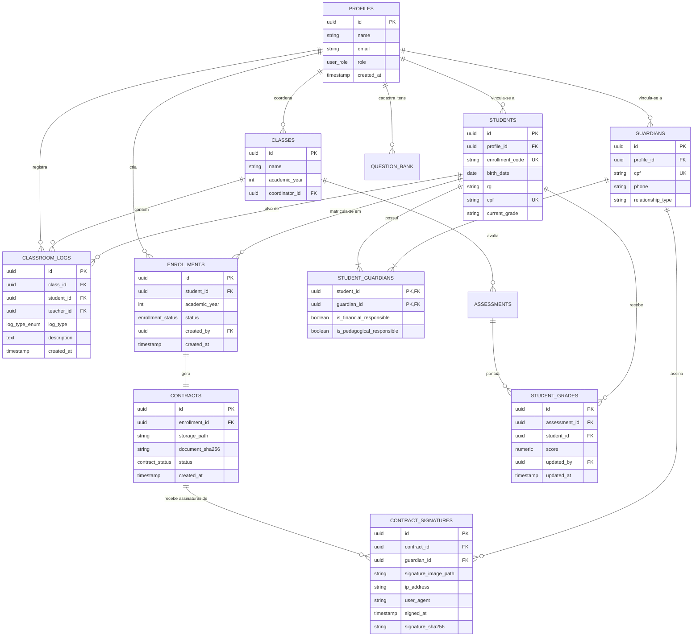
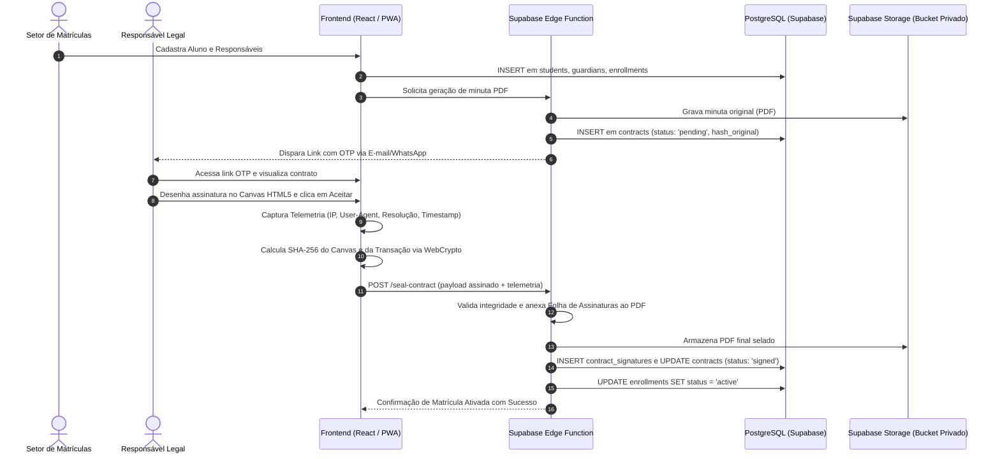

# Documento de Arquitetura, Segurança e Qualidade
**Sistema Integrado de Gestão Escolar e Matrículas — Colégio Rodin**

Este documento detalha os pilares de infraestrutura, engenharia de software, modelos de segurança e conformidade operacional da plataforma.

---

## 1. Mapa do Sistema (Diagramas UML)

### 1.1 Diagrama de Entidades (MER / Classes)
Abaixo está o modelo relacional completo implementado nativamente no PostgreSQL/Supabase:



---

### 1.2 Diagrama de Sequência: Fluxo de Assinatura Digital Criptográfica Nativa
Demonstração ponta a ponta do ciclo de vida da assinatura sem custos de API de terceiros:



---

## 2. Tabela de Quem Pode o Quê (RBAC - Matriz de Acesso)

| Tabela / Recurso | Admin | Diretor(a) | Coordenador(a) | Secretaria | Setor Matrículas | Professor(a) | Responsável / Aluno |
| :--- | :---: | :---: | :---: | :---: | :---: | :---: | :---: |
| `profiles` | CRUD | R | R | R | R | R (Próprio) | R (Próprio) |
| `students` | CRUD | R | R (Suas turmas) | CRUD | CR | R (Suas turmas) | R (Dependente) |
| `guardians` | CRUD | R | R (Suas turmas) | CRUD | CRUD | R (Suas turmas) | R (Próprio) |
| `enrollments` | CRUD | R | R | CRUD | CRUD | Nenhuma | R (Dependente) |
| `contracts` | CRUD | R | R | R | CRUD | Nenhuma | R (Dependente) |
| `contract_signatures`| CRUD | R | R | R | R | Nenhuma | CR (Dependente) |
| `classes` | CRUD | CRUD | R (Suas turmas) | CRUD | R | R (Suas turmas) | R (Matriculada) |
| `classroom_logs` | CRUD | CRUD | CRUD (Suas turmas)| R | Nenhuma | CRUD (Suas turmas)| R (Dependente) |
| `question_bank` | CRUD | CRUD | R | R | Nenhuma | CRUD (Próprias) | Nenhuma |
| `assessments` | CRUD | CRUD | CRUD | CRUD | Nenhuma | CRUD (Suas turmas)| R (Matriculada) |
| `student_grades` | CRUD | CRUD | R (Suas turmas) | CRUD | Nenhuma | CRUD (Suas turmas)| R (Dependente) |

*Legenda: **C** = Criar, **R** = Ler, **U** = Atualizar, **D** = Deletar.*

---

## 3. Separação de Clientes (Multi-tenancy)

Caso a plataforma seja expandida para atender múltiplas unidades escolares ou franquias do Colégio Rodin:
- Todas as tabelas passam a herdar a coluna obrigatória `tenant_id UUID REFERENCES tenants(id)`.
- Criação de índices compostos em `(tenant_id, id)` e `(tenant_id, created_at)` para otimização de busca.
- As políticas de RLS passam a validar `auth.jwt() ->> 'tenant_id' = tenant_id`.

---

## 4. Trava dentro do Banco (Row Level Security - RLS)

Todas as tabelas possuem RLS habilitado obrigatoriamente (`ALTER TABLE ... ENABLE ROW LEVEL SECURITY;`). Isso impede que qualquer requisição via API execute bypass de regras de negócio.

### Exemplos Reais de Políticas RLS:

```sql
-- 1. Coordenador só enxerga ocorrências de turmas a ele delegadas
CREATE POLICY "coordinators_view_assigned_class_logs"
ON classroom_logs FOR SELECT
USING (
    EXISTS (
        SELECT 1 FROM classes
        WHERE classes.id = classroom_logs.class_id
        AND classes.coordinator_id = auth.uid()
    )
    OR
    EXISTS (
        SELECT 1 FROM profiles
        WHERE profiles.id = auth.uid()
        AND profiles.role IN ('admin', 'director')
    )
);

-- 2. Responsável só acessa contratos dos seus dependentes
CREATE POLICY "guardians_view_own_contracts"
ON contracts FOR SELECT
USING (
    EXISTS (
        SELECT 1 FROM enrollments e
        JOIN student_guardians sg ON sg.student_id = e.student_id
        JOIN guardians g ON g.id = sg.guardian_id
        WHERE e.id = contracts.enrollment_id
        AND g.profile_id = auth.uid()
    )
    OR
    EXISTS (
        SELECT 1 FROM profiles
        WHERE profiles.id = auth.uid()
        AND profiles.role IN ('admin', 'director', 'enrollment', 'secretary')
    )
);

-- 3. Professor só edita logs de sua própria autoria e turmas ativas
CREATE POLICY "teachers_manage_own_classroom_logs"
ON classroom_logs FOR ALL
USING (
    teacher_id = auth.uid()
    OR
    EXISTS (
        SELECT 1 FROM profiles
        WHERE profiles.id = auth.uid()
        AND profiles.role IN ('admin', 'director')
    )
);
```

---

## 5. Nenhuma Senha no Código (Secrets Management)

- **Frontend Client:** Utiliza exclusivamente a `VITE_SUPABASE_ANON_KEY` pública e `VITE_SUPABASE_URL`.
- **Backend / Edge Functions:** Utiliza a `SUPABASE_SERVICE_ROLE_KEY` exclusivamente no ambiente de execução serverless isolado, nunca trafegada para o cliente.
- Arquivo de exemplo versionado: `.env.example`.

```env
# Configurações do Supabase (Frontend)
VITE_SUPABASE_URL=https://xyzcompany.supabase.co
VITE_SUPABASE_ANON_KEY=eyJhbGciOiJIUzI1NiIsInR5cCI6IkpXVCJ9...

# Configurações de Servidor / Edge Functions (Privadas)
SUPABASE_SERVICE_ROLE_KEY=eyJhbGciOiJIUzI1NiIsInR5cCI6IkpXVCJ9...
ENCRYPTION_PEPPER_SECRET=rodin_audit_pepper_secure_seed_2026
```

---

## 6. Botão de Reportar Erro (Error Reporting e Log Capture)

- **Interceptador Global:** Monitoramento de `window.onerror` e `window.onunhandledrejection`.
- **Captura de Contexto:** Geração de snapshot do DOM / Canvas via `html2canvas` em Base64, estado do usuário, perfil autenticado, versão do app e últimos logs do console.
- **Tabela de Telemetria:** Registro na tabela `audit_logs` para diagnóstico imediato pelo time técnico.

---

## 7. Testes Automáticos

```
       / \
      / E2E \       --> Playwright (Jornada: Admissão -> Assinatura -> Fechamento)
     /-------\
    / Integr. \     --> Supertest / Supabase Local (Testes de RLS e Edge Functions)
   /-----------\
  /  Unitários  \   --> Vitest (Cálculo SHA-256, cálculo de médias, validações de CPF)
 /---------------\
```

- **Pipeline de CI/CD:** Execução automática no GitHub Actions a cada *Pull Request*. Bloqueio de merge caso a cobertura fique abaixo de 80% ou testes falhem.

---

## 8. Auditoria de Segurança (Security Audit)

- **Auditoria de Dependências:** `npm audit --audit-level=high` integrado no pipeline de build.
- **SAST (Static Application Security Testing):** ESLint com plugins de segurança (`eslint-plugin-security`).
- **Verificação de RLS:** Script automatizado que roda em banco de staging para assegurar que nenhuma nova tabela foi criada sem política RLS.

---

## 9. Escudo na Frente do Site (WAF, Bot Fight e Rate Limiting)

- **Proteção de Borda Cloudflare:** Modo *Bot Fight*, mitigação de DDoS L3/L4/L7 e SSL Full (Strict).
- **Rate Limiting por IP:**
  - Tentativas de assinatura OTP: Limite de 5 requisições por minuto por IP.
  - Endpoints de autenticação: Bloqueio progressivo de tentativas inválidas.

---

## 10. HTTPS e Cadeado Verde (TLS/SSL + HSTS - Full Strict)

- **Criptografia em Trânsito:** TLS 1.3 obrigatório com cipher suites seguras (ChaCha20-Poly1305 / AES-GCM).
- **Cabeçalhos de Segurança Injetados:**
  ```http
  Strict-Transport-Security: max-age=31536000; includeSubDomains; preload
  X-Content-Type-Options: nosniff
  X-Frame-Options: SAMEORIGIN
  Content-Security-Policy: default-src 'self'; script-src 'self' 'unsafe-inline' https://cdn.jsdelivr.net; style-src 'self' 'unsafe-inline'; img-src 'self' data: blob: https:;
  ```
